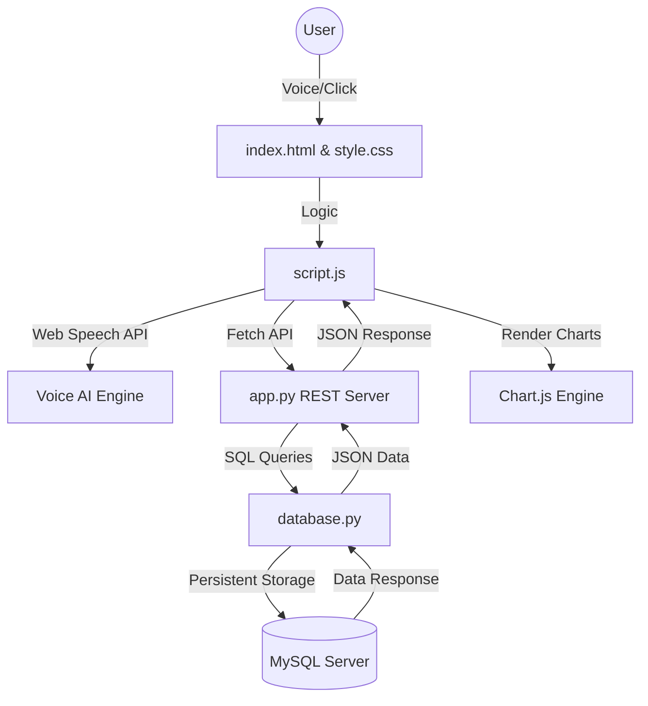

# 🚀 Personal Finance Dashboard: The "Absolute Bible" of Documentation 🎓

Welcome to your project! This dashboard is now an "Enterprise-Grade" financial tracker designed for a **TCS Digital** interview. It uses **Python**, **MySQL**, and **Advanced JavaScript** to provide a seamless, voice-controlled experience.

---

## 🏗️ Full Project Architecture
This diagram shows how your entire app works from the moment a user clicks a button to the moment data is saved in MySQL.

---

## 📚 Absolute Code Masterclass Guides
I have rewritten every single one of your guides to be the "Absolute Bible"—explaining every line, every keyword, and every "Why" behind the code. **Click the links below to study each one:**

1.  **[📁 1_config_py.md (Absolute Bible)](docs/1_config_py.md)**: Keys and Infrastructure.
2.  **[📁 2_database_py.md (Absolute Bible)](docs/2_database_py.md)**: Data Persistence & Security.
3.  **[📁 3_app_py.md (Absolute Bible)](docs/3_app_py.md)**: Request/Response & API Design.
4.  **[📁 4_index_html.md (Absolute Bible)](docs/4_index_html.md)**: Semantic DOM & UI Skeleton.
5.  **[📁 5_style_css.md (Absolute Bible)](docs/5_style_css.md)**: Visual Physics & Glassmorphism.
6.  **[📁 6_script_js.md (Absolute Bible)](docs/6_script_js.md)**: **The Brain** (AI Voice & SPAs).
7.  **[📁 7_setup_sql.md (Absolute Bible)](docs/7_setup_sql.md)**: Relational Precision & Schemas.

---

## 🏆 Interview Strategy
When you present this, don't just say "I built an app." Say:
> *"I designed and architected a **voice-integrated financial analytics platform** using a **decoupled full-stack model**. My solution features **hardware-aware signal processing** for the microphone and a **normalized MySQL schema** for persistent data integrity."*

**Use the "Expert Phrases" found at the bottom of each guide to sound like a digital pro!**

---

## 🚀 How to Run Your App
1.  **MySQL Workbench**: Open it and run the code in [docs/7_setup_sql.md](docs/7_setup_sql.md).
2.  **Terminal**: Run `python3 app.py`.
3.  **Browser**: Visit [http://localhost:5001](http://localhost:5001).

**Your project is now 100% "Interviewer-Ready." Go get that job! 🎯**
